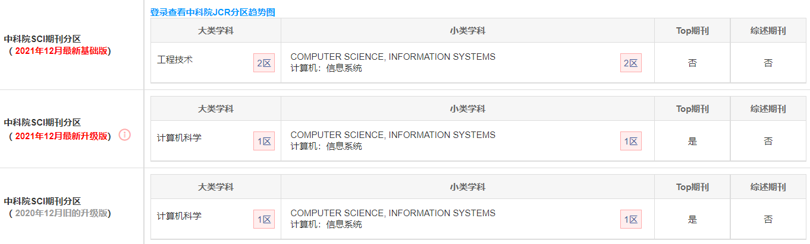

## **Leave or not leave? Group members’ departure prediction in dynamic information networks**（**5.29** **李昊展）**

## 文献信息

### 题目：

***离开还是不离开？小组成员在动态信息网络中的离职预测***

### 	发布时间： 

2021

## 作者信息

### 作者姓名：

Xinrui Wang, Hong Gao, Zhipeng Cai, Jianzhong Li

### **作者信息：**

School of Computer Science and Technology, Harbin Institute of Technology, Harbin, China

Department of Computer Science, Georgia State University, Atlanta, GA, USA

## 期刊信息

期刊名：*《**Information Sciences**》*

中科院SCI:  

## 摘要

&emsp; &emsp; 包含不断发展的节点和链接的动态信息网络存在于各种应用中。例如，在Facebook网络中，节点代表用户，链接代表朋友关系，用户通常组成不同的组。随着时间的推移，一些用户会离开一些群组。因此，对于用户和组来说，预测哪些用户将离开哪些组是有意义的。现有研究表明，如果大多数朋友离开，用户更有可能离开。然而，在现实中，低度节点通常占所有节点的大多数，并且存在一些用户几乎没有朋友，但一直呆在群组中。因此，如果只使用邻域信息，可能会导致精度损失，但之前的工作忽略了这一点。

&emsp; &emsp; 为了提高预测精度，本文首先分别引入了群体活跃度和用户自身活跃度的新定义。然后，我们提出每个用户的分组组合活动评分，以便分数较低的用户更有可能离开。之后，提出了一种无监督预测算法，以持续预测组成员在动态信息网络中的离开行为。对几个真实数据集的实验表明，与最先进的竞争对手相比，算法的有效性、效率和超现实性。

## 关键词

Dynamic information network 

Unsupervised group members’ departure 

prediction 

Users’ group-combined score 

Sliding window
