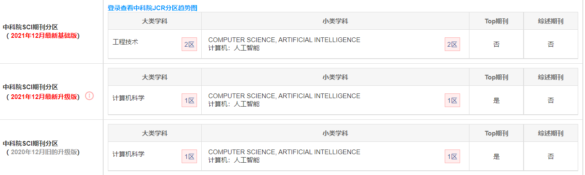
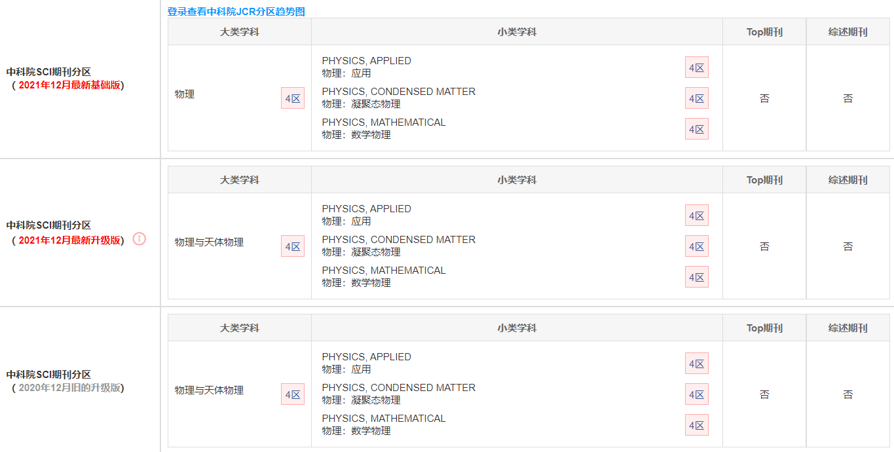

# 2022年5月文献阅读记录

## 2022.05.26

### 文献信息：

#### 	题目：

​		EN：GMM: A Generalized Mechanics Model for Identifying the Importance of Nodes in Complex Networks

​		CN：GMM：用于识别复杂网络中节点重要性的广义力学模型

#### 	期刊：

​		***Knowledge-Based Systems***

​		

#### 	发布时间：

​		29 December 2019 

#### 	作者信息：

​		Fan Liu, Zhen Wang, Yong Deng

​		电子科技大学，基础与前沿科学研究院、英才学院和数学科学学院

​		西北工业大学机械工程学院，光学图像分析与学习中心

​		电子科技大学，基础与前沿科学研究院

### 摘要：

​	本文提出了一个使用全局信息和局部信息的改进的重力模型。为了验证该方法的有效性，在总共十个真实网络上进行了一些实验。特别是，提出了一个创新的基于网络的实验质量评估，以验证识别节点重要性的方法。

### 关键词：

​	Influential nodes, Complex networks, Gravity model

## 2022.05.15

### 文献信息：

#### 	题目：

​		EN：Key node identification of wireless sensor networks based on cascade failure

​		CN：基于级联故障的无线传感器网络的关键节点识别

#### 	期刊：

​		***Modern Physics Letters B***

​		

#### 	发布时间：

​		20 August 2020

#### 	作者信息：

​		Xiao Wang and Jian Du, Rongcheng Zou, Zebo Zhou

​		西南石油大学机械工程学院

​		西北工业大学航空航天学院

​		电子科技大学航空航天学院

### 摘要：

​	无线传感器网络（WSN）是由部署在监测区域的大量微型传感器节点组成的多跳自组织网络。它们可以协同感知、收集和处理监测对象，并将其传输给观察者。在本文中，我们使用级联故障法来寻找WSNs中的关键节点。首先，提出了一个基于负载再分配的复杂网络级联故障模型。与现有模型的区别如下。(1）对于每个节点，定义了一个**过载函数**；（2）网络拓扑结构的演变被**节点权重的演变**所取代。基于级联故障模型，提出了**一种评估复杂负载网络节点重要性的方法**，并给出了节点重要性的新定义。该方法有助于发现网络中一些潜在的 "关键节点"。最后的实验分析验证了所提方法的有效性和可行性。

### 关键词：

​	Cascade failure; node importance; invulnerability; load; wireless sensor networks.