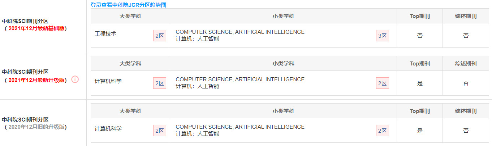

# A new approach for evaluating node importance in complex networks via deep learning methods

## 文献信息

### 题目：

***一种通过深度学习方法评估复杂网络中节点重要性的新方法***

### 	发布时间： 

2 May 2022

## 摘要

节点重要性的评价是网络科学中的一个重要研究课题，以往解决这个问题的工作要么考虑单一指标，要么为多个指标分配权重，要么通过手工选择特征。

为了解决这些问题，本文提出了一种名为CGNN的新方法，以识别基于深度学习方法的有影响力的节点，包括<u>卷积神经网络（CNNs）</u>和<u>图谱神经网络（GNNs）</u>。CGNN通过**<u>收缩算法</u>**获得特征矩阵，并通过**<u>易感-感染-恢复（SIR）模型获得标签</u>**，这将被用来学习节点的隐藏表征，而不利用任何网络指标作为特征。本文采用三个评价标准来验证CGNN的有效性和可区分性，包括Kendall's相关系数、<u>单调性指数（MI）</u>和<u>排名分布函数（RDF）</u>。

## 内容总结

1. 针对网络中节点的特征，提出了改进的**节点收缩算法**，值得注意
2. 采用了MI和RDF指数考量方法的排名区分度

## 关键词

Influential node 

Complex network 

Convolutional neural network 

Graph neural network

## 作者信息

### 作者姓名：

Min Zhang a,b, Xiaojuan Wang a,⇑, Lei Jin a, Mei Song a, Ziyang Li c

### **作者信息：**

School of Electronic Engineering, Beijing University of Posts and Telecommunications, Beijing, China 

School of Science, Beijing University of Posts and Telecommunications, Beijing, China 

School of Mechanical Science and Engineering, Huazhong University of Science and Technology, Wuhan, China

## 期刊信息

期刊名：***Neurocomputing***

中科院SCI:  

