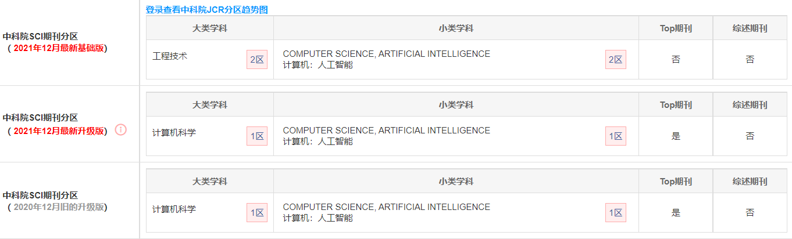

# An improved gravity model to identify influential nodes in complex networks based on k-shell method

## 文献信息

### 题目：

***基于K壳法的改进的重力模型来识别复杂网络中具有影响力的节点***

### 	发布时间： 

2 June 2021

## 关键词

Complex networks 

Influential nodes 

Gravity model 

K-shell

## 摘要

寻找复杂网络中的重要节点是一个基本问题。最近提出了许多方法来解决这个问题，但以前的研究大多有局限性，其中很少考虑网络的局部和全局信息。节点的位置是网络中节点的一个重要属性，但以前在识别节点的重要性时很少被考虑。

为了解决这个问题，本文在K壳算法的基础上提出了一种改进的引力中心度，名为KSGC，用于识别复杂网络中具有影响力的节点。本文的方法考虑了节点的位置，与原来的重力中心度相比，更加合理。在现实世界的网络中进行的一些实验表明，本文的方法可以有效地评估复杂网络中节点的重要性。

## 内容总结

提出了基于k-shell值的**<u>吸引系数</u>**，对节点对的相互作用力进行了不对称修正：位置越靠近网络中心的节点对其他节点作用力更大，反之则更小。

## 作者信息

### 作者姓名：

Xuan Yang, Fuyuan Xiao

### **作者信息：**

School of Computer and Information Science, Southwest University, Chongqing, 400715, China

## 期刊信息

期刊名：*《**Knowledge-Based Systems**》*

中科院SCI:  

