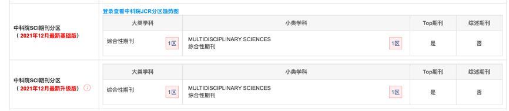

# Topological measures for identifying and predicting the spread of complex contagions

## 文献信息

### 题目：

***识别和预测复杂传染传播的拓扑措施***

### 	发布时间： 

July 2021

## 作者信息

### 作者姓名：

Douglas Guilbeault、Damon Centola

### **作者信息：**

加州大学伯克利分校哈斯商学院

宾夕法尼亚大学安纳伯格传播学院

美国宾夕法尼亚大学工程学院

## 期刊信息

期刊名：*《**Nature Communication**》*

中科院SCI:  

## 摘要

社会网络中距离的标准衡量标准--平均最短路径长度--假定了一个 "简单 "的传染模型，即人们只需要接触到一个同伴的影响就可以采用这种传染。然而，许多社会现象是 "复杂 "的传染，人们需要接触到多个同伴才能采用。在这里，文章表明，经典的路径长度测量方法无法定义复杂传染的网络连接性和节点中心性。基于经典的路径长度定义的中心性测量和播种策略经常误判对传播复杂传染病最有效的网络特征。为了解决这些问题，本文推导出复杂路径长度和复杂中心度的测量方法，这大大提高了识别最适合传播复杂传染病的网络结构和中心个体的能力，并应用43个印度农村的小额信贷项目传播的经验数据验证了理论。

## 内容总结
