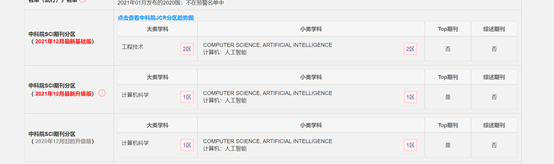

# Node deletion-based algorithm for blocking maximizing on negative influence from uncertain source

## 文献信息

### 题目：

***基于节点删除的不确定源负面影响最大阻塞算法***

### 	发布时间： 

2021.8

### 作者姓名：

Weijia Ju, Ling Chen, Bin Li, Yixin Chen2, Xiaobing Sun

### **作者信息：**

扬州大学信息工程学院；美国圣路易斯华盛顿大学计算机科学系

## 期刊信息

期刊名：*《**Knowledge-Based Systems**》*

中科院SCI:  

## 摘要

&emsp; &emsp; 在社交网络中，流行病、谣言、虚假信息、计算机病毒等负面影响的传播可能会导致严重的后果。**负面影响阻碍最大化**的问题引起了研究者的浓厚兴趣。然而，在现实的社交网络环境中，负面影响的确切来源通常是未知的。在大多数情况下，我们只知道负种子的分布，也就是每个节点成为负种子的概率。在这项工作中，我们研究了最大限度地阻塞来自不确定来源的负面影响的问题。针对这一问题，我们提出了竞争影响线性阈值传播模型(CI-LTPM)。基于IC-LTPM模型，我们定义了不确定负源影响阻塞最大化问题(UNS-IBM)。我们使用live-edge (LE)子图中的传播树来估计影响传播。提出了一种基于LE子图传播树的正种子块增量计算算法。我们观察到正种子的阻塞效应是将正种子及其相关边从LE子图中删除后对负影响的减少。在此基础上，我们提出了一种基于节点删除的算法NDB (node- delete -blocking)来解决UNS-IBM问题。实验结果表明，与其他方法相比，NDB可以在较短的计算时间内屏蔽更多的负面影响。

## 内容总结

**1)**  针对正面和负面影响同时传播的竞争性社交网络，我们定义了一个扩展的LT传播模型CI-LTPM。基于CI-LTPM模型，我们正式定义了不确定负源的影响阻塞最大化问题(UNS-IBM)。

**2)**  为了避免对影响传播过程的模拟耗时，我们在LE子图中提出了传播树来估计影响传播。

**3)**  提出了一种基于LE子图中传播树的负影响阻塞增量计算算法。

**4)**  我们提出了一种基于节点删除的算法NDB (node delete-blocking)来解决UNS-IBM问题。
