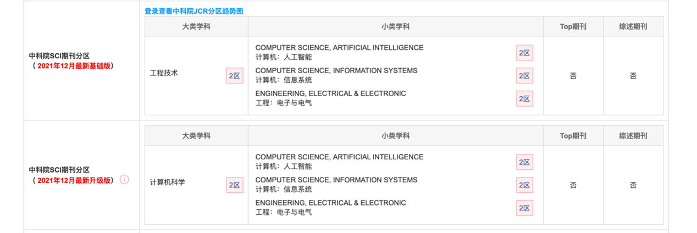

# **Personalized Influential Topic Search via Social Network Summarization**

## 文献信息

### 题目：

***通过社交网络摘要进行个性化的有影响力的主题搜索***

### 	发布时间： 

2016

### 作者姓名：

Jianxin Li、Chengfei Liu、Jeffrey Xu Yu、Yi Chen、Timos Sellis、J. Shane Culpepper

### **作者信息：**

School of Computer Science and Information Technology, RMIT, Australia.

Faculty of Science, Engineering and Technology, Swinburne University of Technology, Australia

Department of Systems Engineering & Engineering Management, The Chinese University of Hong Kong

College of Computing Sciences, New Jersey Institute of Technology, USA

Faculty of Science, Engineering and Technology, Swinburne University of Technology, Australia

School of Computer Science and Information Technology, RMIT, Australia.

## 期刊信息

期刊名：*《**IEEE Transactions on Knowledge and Data Engineering**》*

中科院SCI:  

## 摘要

&emsp; &emsp; 社交网络是向朋友和同事传播信息的重要机制。在这项工作中，我们调查了一个重要问题——社交网络中的个性化有影响力的主题（PIT）搜索：给定用户u在社交网络中发布的关键字查询q，PIT搜索是找到对查询用户u最具影响力的顶级q相关主题。主题对查询用户的影响取决于**查询用户与社交网络中包含该主题的社交用户之间的社交联系。**为了在类似的粒度尺度上衡量主题的影响，我们需要提取社交网络关于主题的社会总结。为了进行有效的主题感知社会总结，我们提出了两种基于随机行走的方法：随机聚类和L长随机行走。根据所提出的方法，我们可以找到一小部分具有影响力分数的代表用户，以模拟社交网络中大量主题用户对该主题的影响。选定的代表用户表示为在社交网络上传播的主题感知影响的社会总结。然后，我们通过将其应用于个性化有影响力的主题搜索问题来验证社会总结的有用性。最后，我们使用现实世界的数据集评估了算法的性能，并表明该方法在实践中是高效和有效的。

## 内容总结

1. 开发了两种新的基于随机漫步的方法来选择社会网络中的话题敏感的代表节点。这可以捕捉到一个话题在社会网络的不同部分的局部影响。
2. 设计了一个top-k PIT-Search算法，根据提出的预先计算的指数，有效地计算出一个用户的k个最有影响力的q相关话题。
3. 使用一个大型的Twitter数据集来评估所提出的技术的效率和效果，并通过与以前的社交网络工作中的三个基线进行比较来显示我们方法的优势。
