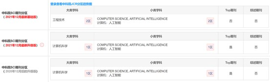

# GMM : A generalized mechanics model for identifying the importance of nodes in complex networks

## 作者信息

### 作者：

Fan Liu, Zhen Wang, Yong Deng 

### **作者信息：**

​	电子科技大学，基础与前沿科学研究院、英才学院和数学科学学院

​	西北工业大学机械工程学院，光学图像分析与学习中心

​	电子科技大学，基础与前沿科学研究院**

## 文献期刊

期刊名：《Knowledge-Based Systems》

中科院SCI:  

## 摘要

本文提出了一个使用全局信息和局部信息的改进的重力模型。为了验证该方法的有效性，在总共十个真实网络上进行了一些实验。特别是，提出了一个创新的基于网络的实验质量评估，以验证识别节点重要性的方法。

## 关键词

Influential nodes, Complex networks, Gravity model